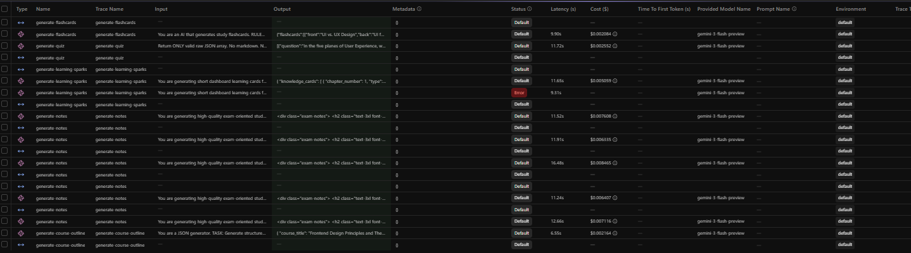

# AI Learning Management System

A serverless AI-powered learning platform that generates structured study material — course outlines, chapter notes, quizzes, flashcards, and learning sparks — from a single topic input.


## Tech Stack

- **Framework**: Next.js 16 (App Router)
- **Database**: Neon PostgreSQL + Drizzle ORM
- **AI Model**: Gemini 3 Flash Preview
- **Background Jobs**: Inngest (event-driven workflows)
- **Auth**: Clerk
- **Payments**: Stripe Checkout + Webhooks
- **Rate Limiting**: ArcJet (token-bucket)
- **Observability**: Langfuse (LLM tracing)
- **Alerts**: Resend (email on job failures)

## AI Pipelines

Five AI generation pipelines produce study content from a single topic:

```
User enters topic
      │
      ▼
1. Course Outline (synchronous — ~6.5s, ~$0.002)
      │
      ▼  fires notes.generate event
2. Chapter Notes (async via Inngest — ~12s/chapter, ~$0.007/chapter)
      │
      ▼  fires learning-spark.generate event
3. Learning Sparks (async via Inngest — ~11s, ~$0.005)

── Triggered separately by user ──

4. Quiz (async via Inngest — ~12s, ~$0.003)
5. Flashcards (async via Inngest — ~10s, ~$0.001)
```

**Total cost per course: ~$0.05**

## Observability — Langfuse Dashboard

All AI calls are traced with input prompts, output content, latency, token usage, and cost:



**Key metrics (from live data):**
| Metric | Value |
|---|---|
| Avg. latency | ~11s |
| Cost per course | ~$0.05 |
| Error recovery | Automatic via Inngest retries |

## Features

- **3-Tier Subscription Gating** — Basic (5 credits), Student (15), Gold (100) with per-plan credit quotas
- **Token-Bucket Rate Limiting** — ArcJet prevents burst abuse on AI endpoints
- **Automated Monthly Resets** — Inngest cron resets credits on the 1st of every month
- **Idempotent Requests** — Duplicate quiz/flashcard requests return cached results
- **Event-Chained Pipelines** — Notes completion automatically triggers learning spark generation
- **Stripe Payments** — Webhook-verified plan upgrades with metadata-driven tier promotion
- **Failure Alerting** — Catch-all Inngest handler sends email alerts via Resend on any pipeline error

## Getting Started

```bash
# Install dependencies
npm install

# Run the dev server
npm run dev

# Run Inngest dev server (separate terminal)
npm run inngest:dev
```

Open [http://localhost:3000](http://localhost:3000) to use the app.

## Environment Variables

Create a `.env.local` file with:

```
NEXT_PUBLIC_DATABASE_CONNECTION_STRING=   # Neon PostgreSQL connection string
NEXT_PUBLIC_CLERK_PUBLISHABLE_KEY=       # Clerk publishable key
CLERK_SECRET_KEY=                         # Clerk secret key
GEMINI_API_KEY=                           # Google Gemini API key
ARCJET_KEY=                               # ArcJet rate limiting key
STRIPE_SECRET_KEY=                        # Stripe secret key
STRIPE_WEBHOOK_SECRET=                    # Stripe webhook signing secret
RESEND_API_KEY=                           # Resend email API key
LANGFUSE_SECRET_KEY=                      # Langfuse secret key
LANGFUSE_PUBLIC_KEY=                      # Langfuse public key
LANGFUSE_BASE_URL=                        # Langfuse base URL
```
