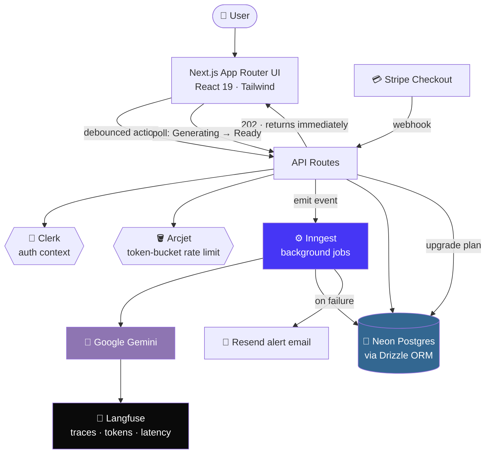
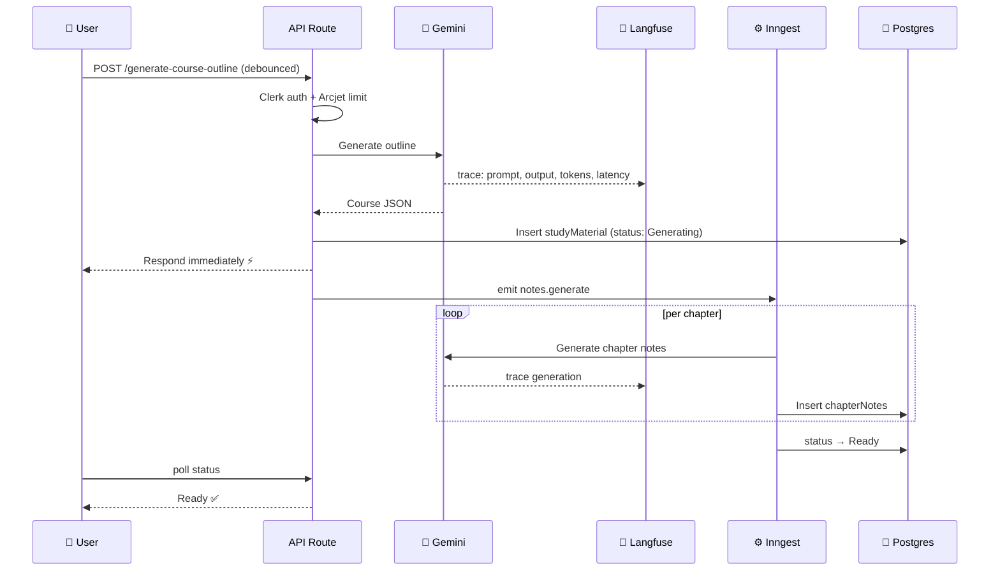
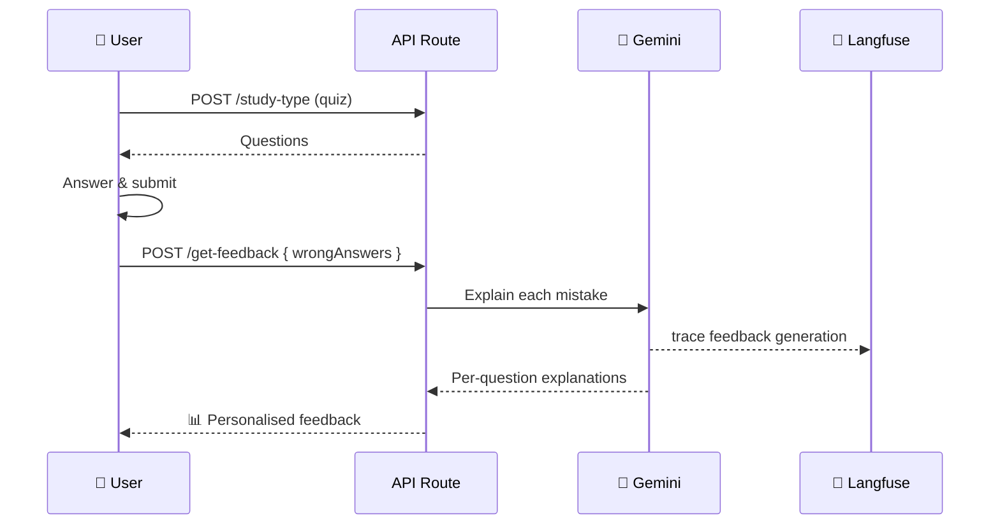

<div align="center">

# 🎓 Easy Learn

### An AI-powered Learning Management System

**Turn any topic into a full course — outline, notes, flashcards, quizzes, and personalised feedback — in minutes.**

[](https://easy-learn-mg.vercel.app/)
[](https://github.com/shubhamraj2604/AI_Learning_Management)

<br/>


<br/>


</div>

---

## 📖 Table of Contents

| | | |
|---|---|---|
| [✨ Overview](#-overview) | [🚀 Features](#-features) | [🔭 AI Observability (Langfuse)](#-ai-observability-with-langfuse) |
| [🏛️ Architecture](#️-architecture) | [🏗️ System Design](#️-system-design--performance) | [🧠 Tech Stack](#-tech-stack) |
| [⚡ Getting Started](#-getting-started) | [🔑 Environment Variables](#-environment-variables) | [🗂️ Project Structure](#️-project-structure) |
| [🔌 API Reference](#-api-reference) | [🔄 Data Flows](#-data-flows) | [📊 Status & Roadmap](#-status--roadmap) |

---

## ✨ Overview

Easy Learn is a full-stack LMS where a learner types in a topic and gets a complete, structured study kit generated for them. Everything heavy runs **asynchronously in the background**, every AI call is **rate-limited, cost-controlled, and traced**, and the UI never blocks while generation happens.

> **The core idea:** AI features are easy to demo and hard to run. This project treats generation as a *production workload* — queued, observable, budgeted, and safe to fail.

| | |
|---|---|
| 🎯 **What it does** | Generates courses, chapter notes, flashcards, quizzes, and wrong-answer feedback |
| ⚙️ **How it scales** | Inngest background jobs + status polling, so requests return instantly |
| 💰 **How costs stay sane** | Per-user token-bucket rate limiting (Arcjet) + frontend debouncing |
| 🔭 **How it stays debuggable** | Full Langfuse tracing on every AI generation |
| 💳 **How it monetises** | Stripe Checkout with webhook-driven Student / Gold tiers |

---

## 🚀 Features

<table>
<tr>
<td width="50%" valign="top">

### 📚 AI Course Creation
Enter a topic, study type, and difficulty — Gemini returns a structured course outline with chapters, which is stored and rendered as a full course.

</td>
<td width="50%" valign="top">

### 📝 Notes Generation
Chapter-by-chapter HTML study notes generated in the background, sanitised with DOMPurify and served in a clean prev/next reader.

</td>
</tr>
<tr>
<td width="50%" valign="top">

### 🧩 Flashcards
Up to **15 AI-generated flashcards per chapter**, produced on demand from the course content for fast revision.

</td>
<td width="50%" valign="top">

### 🧠 Quiz Generation
Multiple-choice quizzes generated per course, with scoring and instant results on submission.

</td>
</tr>
<tr>
<td width="50%" valign="top">

### 📊 Intelligent Quiz Feedback
After submission, only the **wrong answers** are sent to the model, which explains each mistake individually — feedback is never pre-generated.

</td>
<td width="50%" valign="top">

### 🔥 Study Spark
A daily study prompt on the dashboard that nudges learners back into consistent revision.

</td>
</tr>
<tr>
<td width="50%" valign="top">

### 💳 Subscriptions & Payments
**Stripe Checkout** for Student / Gold tiers. Membership is upgraded by **webhook** on successful payment, never by client-side state.

</td>
<td width="50%" valign="top">

### 📧 Email Alerts
**Resend**-powered notifications when a background AI job fails, so silent Inngest errors don't go unnoticed.

</td>
</tr>
<tr>
<td width="50%" valign="top">

### 🔐 Authentication
**Clerk**-secured sessions. Every course, quiz, and progress record is scoped to the authenticated user.

</td>
<td width="50%" valign="top">

### 🎨 Modern UI
Next.js App Router + Tailwind 4 + shadcn/ui, with GSAP / Three.js / OGL powered motion and React Hot Toast feedback.

</td>
</tr>
</table>

---

## 🔭 AI Observability with Langfuse

> Previously a "future improvement" — **now wired into the app.** Every model call in Easy Learn is traced end to end.

Generative features fail in ways normal backends don't: the request returns `200`, but the JSON is malformed, the outline is thin, or a single chapter quietly burns half your token budget. **Langfuse** makes those failures visible instead of invisible.

### What gets traced

| Traced operation | What it tells you |
|---|---|
| `generate-course-outline` | Prompt, model output, latency, tokens for the initial course skeleton |
| `generate-notes` | One generation per chapter — spot the chapter that's slow or oversized |
| `generate-flashcards` | Input chapter summaries vs. the flashcard JSON returned |
| `generate-quiz` | Prompt version, parse success/failure, question count |
| `generate-feedback` | Wrong-answer payload in, per-question explanations out |

### Why it matters here

- **🐞 Debug bad output, not just errors** — replay the exact prompt that produced a broken course outline instead of guessing.
- **💸 Cost & token visibility** — see which feature actually drives Gemini spend (spoiler: per-chapter notes).
- **⏱️ Latency breakdown** — find whether slowness is the model, the parse step, or the DB write.
- **📦 Background-job insight** — Inngest jobs run off-request, so without tracing they're a black box. Traces give them a UI.
- **🧪 Prompt iteration** — compare outputs across prompt versions before shipping a change.

### How it's wired

A single Langfuse client is shared across the app and used to open a trace per AI operation. Because Gemini calls happen inside Inngest steps, traces are **flushed before the job completes** so nothing is lost when the serverless function exits.

```ts
// lib/langfuse.ts
import { Langfuse } from "langfuse";

export const langfuse = new Langfuse({
  publicKey: process.env.LANGFUSE_PUBLIC_KEY!,
  secretKey: process.env.LANGFUSE_SECRET_KEY!,
  baseUrl: process.env.LANGFUSE_BASEURL ?? "https://cloud.langfuse.com",
});
```

```ts
// Example: tracing a Gemini generation
const trace = langfuse.trace({
  name: "generate-course-outline",
  userId,                       // trusted Clerk user id, never client-supplied
  metadata: { topic, difficulty, studyType },
});

const generation = trace.generation({
  name: "gemini-outline",
  model: "gemini-3-flash-preview",
  input: prompt,
});

const result = await generateCourseOutline(prompt);

generation.end({ output: result });

// Critical in serverless / Inngest steps — the process may exit immediately
await langfuse.flushAsync();
```

> 💡 **Tip:** on `langfuse@3.x` the base-URL variable is `LANGFUSE_BASEURL`. Newer major versions renamed it to `LANGFUSE_BASE_URL` — keep that in mind when upgrading.

---

## 🏛️ Architecture



---

## 🏗️ System Design & Performance

<details open>
<summary><b>🪣 Rate Limiting & AI Cost Control</b></summary>
<br/>

- **Token-bucket rate limiting** via **Arcjet**, applied **per authenticated user** — not per IP.
- Limits are tiered by how expensive the operation is:

| Operation | Cost | Limit tier |
|---|---|---|
| Course generation | 🔴 Highest (multi-chapter fan-out) | Strict |
| Quiz & flashcard generation | 🟠 Moderate | Moderate |
| Read-only endpoints | 🟢 Cheap | Light |

- Prevents abuse, enforces fair usage, and puts a hard ceiling on AI API spend.

</details>

<details open>
<summary><b>🔄 Asynchronous Processing & Polling</b></summary>
<br/>

- Long-running generation is handed to **Inngest background jobs**.
- The API responds **immediately** — the request never waits on the model.
- The frontend **polls** for status (`Generating → Ready`) and swaps the CTA from *Generate* to *View*.
- Result: no request timeouts, no frozen UI, and retries handled by the job runner.

</details>

<details open>
<summary><b>⏳ Debouncing & Duplicate Request Prevention</b></summary>
<br/>

- Generation actions (e.g. *Generate Course*) are **debounced** on the client.
- Rapid double-clicks can't fan out into multiple background jobs.
- Cuts redundant Gemini calls — the cheapest AI request is the one you never send.

</details>

<details open>
<summary><b>🔐 Secure Request Handling</b></summary>
<br/>

- All sensitive endpoints sit behind authentication.
- Rate limiting and access control derive from **trusted server-side auth context**.
- **Client-supplied identifiers are never trusted** for security or ownership decisions.
- Membership upgrades come from **Stripe webhooks**, not from the browser.
- AI-generated HTML notes are sanitised with **DOMPurify** before rendering.

</details>

<details open>
<summary><b>🔭 Observability & Failure Handling</b></summary>
<br/>

- **Langfuse** traces every generation: prompt, output, model, latency, tokens.
- **Resend** emails on background job failure, so async errors surface loudly.
- Status columns (`Generating` / `Ready`) make partial state visible in the DB itself.

</details>

---

## 🧠 Tech Stack

<div align="center">

| Layer | Technology |
|---|---|
| **Framework** | Next.js 16 (App Router) |
| **UI** | React 19 · Tailwind CSS 4 · shadcn/ui · Radix UI · Lucide |
| **Motion / 3D** | GSAP · Three.js · OGL · postprocessing · React Bits |
| **State** | Zustand |
| **Auth** | Clerk |
| **Database** | Neon (PostgreSQL) |
| **ORM** | Drizzle ORM (fully type-safe) |
| **AI** | Google Gemini (`@google/genai`) |
| **AI Observability** | **Langfuse** |
| **Background jobs** | Inngest |
| **Rate limiting / security** | Arcjet |
| **Payments** | Stripe (Checkout + webhooks) |
| **Email** | Resend |
| **Notifications** | React Hot Toast |
| **Sanitisation** | DOMPurify |
| **Deployment** | Vercel · Docker-ready |

</div>

---

## ⚡ Getting Started

### Prerequisites

- **Node.js 18+** and npm
- A **Neon** (PostgreSQL) database
- A **Google Gemini** API key
- A **Clerk** account
- *Optional:* Inngest, Arcjet, Langfuse, Stripe, and Resend accounts

### Installation

```bash
# 1 — Clone
git clone https://github.com/shubhamraj2604/AI_Learning_Management.git
cd AI_Learning_Management

# 2 — Install
npm install

# 3 — Configure environment
cp .env.example .env.local   # then fill in the values below

# 4 — Push the database schema
npx drizzle-kit push

# 5 — Run the app
npm run dev

# 6 — In a second terminal, run the Inngest dev server
npm run inngest:dev
```

Open **http://localhost:3000** 🎉

### Production

```bash
npm run build
npm start
```

### 🐳 Docker

```bash
docker build -t easy-learn .
docker run -p 3000:3000 --env-file .env.local easy-learn
```

---

## 🔑 Environment Variables

| Variable | Required | Description |
|---|:---:|---|
| `NEXT_PUBLIC_DATABASE_CONNECTION_STRING` | ✅ | Neon PostgreSQL connection string |
| `GEMINI_API_KEY` | ✅ | Google Gemini API key |
| `NEXT_PUBLIC_CLERK_PUBLISHABLE_KEY` | ✅ | Clerk publishable key |
| `CLERK_SECRET_KEY` | ✅ | Clerk secret key |
| `ARCJET_KEY` | ⬜ | Arcjet key — rate limiting is skipped if unset |
| `INNGEST_SIGNING_KEY` | ⬜ | Inngest signing key (production) |
| `LANGFUSE_PUBLIC_KEY` | ⬜ | Langfuse public key — tracing is skipped if unset |
| `LANGFUSE_SECRET_KEY` | ⬜ | Langfuse secret key |
| `LANGFUSE_BASEURL` | ⬜ | Langfuse host (defaults to `https://cloud.langfuse.com`) |
| `STRIPE_SECRET_KEY` | ⬜ | Stripe secret key for Checkout |
| `STRIPE_WEBHOOK_SECRET` | ⬜ | Verifies incoming Stripe webhooks |
| `RESEND_API_KEY` | ⬜ | Resend key for job-failure alert emails |

> ⚠️ Never commit `.env.local`. All secret keys are server-side only — anything prefixed `NEXT_PUBLIC_` is exposed to the browser.

---

## 🗂️ Project Structure

```
ai_lms/
├── app/
│   ├── api/                          # API routes
│   │   ├── generate-course-outline/  # Course outline (Gemini) + triggers notes job
│   │   ├── generate-study-type-content/  # Flashcards / quiz + status polling
│   │   ├── study-type/               # Fetch notes | quiz | ALL
│   │   ├── show-courses/             # User's courses
│   │   ├── get-feedback/             # AI feedback on wrong answers
│   │   ├── Create-User/              # Sync Clerk user → DB
│   │   └── inngest/                  # Inngest webhook handler
│   ├── course/[courseId]/            # Course detail & study materials
│   │   ├── notes/  flashcard/  quiz/  qa/
│   │   └── _components/
│   ├── create/                       # Multi-step course creation
│   ├── dashboard/                    # Course list, Study Spark
│   ├── layout.tsx · page.tsx · globals.css
├── components/                       # Reusable UI (shadcn)
├── configs/
│   ├── AiModel.js                    # Gemini wrappers + prompts
│   ├── db.js                         # Drizzle connection
│   └── schema.js                     # DB tables
├── inngest/
│   ├── client.js
│   └── function.js                   # Background jobs
├── lib/
│   ├── arcjet.ts                     # Rate limiting rules
│   └── langfuse.ts                   # 🔭 Langfuse client + tracing helpers
├── store/                            # Zustand stores
├── Dockerfile · drizzle.config.js · middleware.js
└── DOCUMENTATION.md                  # Deep-dive technical docs
```

📄 **Full technical docs:** [`DOCUMENTATION.md`](./DOCUMENTATION.md)

---

## 🔌 API Reference

| Method | Endpoint | Purpose | Auth | Rate limit |
|---|---|---|:---:|:---:|
| `POST` | `/api/generate-course-outline` | Create course + AI outline, trigger notes job | ✅ | Strict |
| `POST` | `/api/generate-study-type-content` | Start flashcard / quiz generation | ✅ | Moderate |
| `GET` | `/api/generate-study-type-content` | Poll status → `Generating` \| `Ready` | ✅ | Light |
| `POST` | `/api/study-type` | Fetch `notes` \| `quiz` \| `ALL` | ✅ | Light |
| `GET` | `/api/show-courses` | List user courses / fetch one | ✅ | Light |
| `POST` | `/api/get-feedback` | AI explanations for wrong answers | ✅ | Moderate |
| `POST` | `/api/Create-User` | Sync Clerk user into `users` table | ✅ | — |
| `*` | `/api/inngest` | Inngest background-job webhook | 🔑 signed | — |

### ⚙️ Background Jobs (Inngest)

| Function | Event | Purpose |
|---|---|---|
| `CreateNewUser` | `user.create` | Insert / update the Clerk user in `users` |
| `createNotes` | `notes.generate` | Generate HTML notes per chapter, then mark course `Ready` |
| `GenerateStudyTypeContent` | `studyType.content` | Generate flashcards / quiz, then mark record `Ready` |

### 🗄️ Database Schema

| Table | Key columns |
|---|---|
| `users` | `userName`, `email`, `isMember`, `plan` |
| `studyMaterial` | `courseId`, `courseType`, `topic`, `difficultyLevel`, `courseLayout` (json), `createdBy`, `status` |
| `chapterNotes` | `courseId`, `chapterId`, `notes` (HTML) |
| `studyTypeContent` | `courseId`, `content` (json), `type`, `status` |

---

## 🔄 Data Flows

### Course creation → notes



### Quiz → feedback



---

## 📊 Status & Roadmap

<table>
<tr><th align="left">✅ Shipped</th><th align="left">🚧 In progress</th><th align="left">📌 Planned</th></tr>
<tr valign="top">
<td>

- Course creation
- Notes generation
- Flashcards
- Quiz generation
- AI feedback on wrong answers
- Study Spark
- Stripe subscriptions (Student / Gold)
- Email failure alerts
- Arcjet rate limiting
- **Langfuse AI tracing**

</td>
<td>

- Q/A mode
- Profile section
- User analytics for study performance

</td>
<td>

- Course-specific AI chatbots
- Progress & analytics dashboard
- Spaced repetition for flashcards
- Course sharing & collaboration
- Langfuse evals + prompt management
- AWS deployment for scale

</td>
</tr>
</table>

---

## 🧑‍💻 Author

<div align="center">

**Shubham Raj**
Computer Science & Engineering — BIT Mesra

[](https://github.com/shubhamraj2604)
[](https://shubhamraj26.netlify.app/)

</div>

---

<div align="center">

### ⭐ If this project helped or inspired you

**Give it a star on GitHub — it genuinely helps!**

<sub>Built with Next.js, Gemini, and a lot of background jobs.</sub>

</div>
